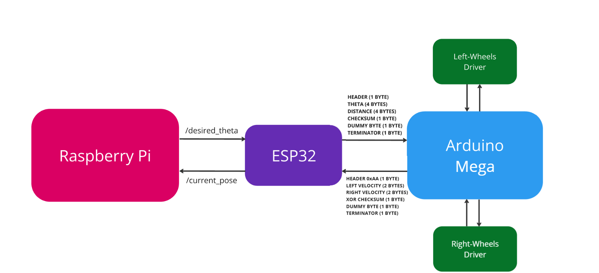

## Ouick Overview

This repo hopefully walks you through the code I wrote for my graduation project—how it works, what its issues and limitations are, and how you can get it running on your own hardware.
I originally wanted to use *MATLAB/Simulink* to build all the models and generate code with *Simulink Coder*. Sure, building everything from scratch gives you a tighter grip over the system and more flexibility—but with the limited time I had, it just wasn’t practical. So I had to make a few compromises.

The first was using *ROS2* as my middleware. Writing your own can be fun, no doubt—but let’s be honest, it’s kind of obsolete. ROS2 is mature, well-supported, and saves a ton of time. Now, the elephant in the room was figuring out how to integrate the already developed and tested Simulink models into the ROS2 environment. Luckily, the *ROS Toolbox* came to the rescue—it bridges the gap and makes the whole process surprisingly smooth.

The second one is more of a design choice than a compromise. Trying to achieve real-time performance by deploying the entire codebase—Perception, Mapping, Path Planning, and Control—on a single *Raspberry Pi* is, frankly, a bit of a naive dream. Especially when the code isn’t mature yet. So, I introduced two additional microcontrollers to help distribute the load and keep things responsive—kinda like a mini distributed control system (DCS).

The *Arduino Mega* was chosen mainly because it has four serial communication ports, which fit my design requirements perfectly. Its main job was to control the motors based on incoming control commands and gather feedback, which it then passed on to the second microcontroller, the *ESP32*.
To be completely honest, I added the ESP32 because it supports the *micro-ROS* library, which made it possible to publish the odometry data coming from the Mega. Without that, integrating low-level feedback into the ROS2 ecosystem would’ve been a lot messier.
I also took advantage of the ESP32 by offloading some initial tasks to it—like performing sensor fusion with the IMU. It made sense to handle that locally before passing data into the ROS2 pipeline, and it helped reduce the load on the Raspberry Pi. (See the [figure below](Docs/figures/figure_1.png).)

The third—and thankfully final—compromise was using the [YDLiDAR ROS2 Driver Package](https://github.com/YDLIDAR/ydlidar_ros2_driver) instead of the models I was developing. The models weren’t fully tested yet, and I was running outta time. That said, you’ll still find the Simulink models included in the repo, in case you want to explore or build on it later.

The codebase is pretty diverse—it includes Simulink models, Arduino IDE code (C++), Python scripts, and a bunch of configuration files sprinkled throughout. Hope you enjoy digging into it. 

## Communication Protocols

Achieving *interoperability*—aka getting three entirely different systems to work together and function as one cohesive unit—wasn’t exactly a walk in the park. But it was genuinely rewarding. At the heart of it all was communication: making sure each component could reliably exchange data, stay in sync, and respond in real time. That’s what turned a scattered set of devices into a unified system.

Generally speaking, I had to build two bridges to connect the three devices: one between the Arduino Mega and the ESP32, and another between the ESP32 and the Raspberry Pi. Each bridge supports bidirectional data flow, allowing commands, feedback, and sensor readings to move freely between layers of the system.

The bridge between the ESP32 and Mega follows a basic serial communication setup with the following data protocols:

**Mega -> ESP32**

    • Header (1 byte): A fixed byte, 0xAA, which serves as a clear indicator of the start of a valid data packet.
    • Left Velocity (2 bytes): A signed 16-bit integer representing the instantaneous speed of the left wheel in RPM.
    • Right Velocity (2 bytes): A signed 16-bit integer representing the instantaneous speed of the right wheel in RPM.
    • XOR Checksum (1 byte): A single byte containing the Exclusive OR (XOR) checksum of the header and the four bytes representing the left and right velocities. This byte is used for basic error detection to ensure data integrity during transmission.
    • Dummy Byte (1 byte): A fixed byte, 0xEE, which acts as a placeholder or an additional validation byte within the protocol.
    • Terminator (1 byte): A fixed byte, 0xEF, signaling the definitive end of the data packet, aiding in proper packet demarcation.

 
**ESP32 -> Mega**

    • HEADER (1 byte): A fixed start byte, 0xAA, for packet synchronization and identification.
    • THETA (4 bytes): Four bytes representing the desired heading in radians, encoded as a 32-bit floating-point number.
    • DISTANCE (4 bytes): Four bytes representing the desired distance to travel in meters, also encoded as a 32-bit floating-point number.
    • Checksum (1 byte): A single byte XOR checksum calculated over the HEADER, THETA, and DISTANCE bytes, providing a basic error detection mechanism for the command packet.
    • Dummy Byte (1 byte): A fixed byte, 0xEE, included for protocol robustness and consistency.
    • TERMINATOR (1 byte): A fixed end byte, 0xEF, for clear packet demarcation.

 

**Pi <-> ESP32**

Using micro-ROS library to integrate the ESP32 into the ROS ecosystem by publishing and subscribing to two different custom ROS2 topics:

- */currect_pose* publishes the robot’s instantaneous pose—x, y, and theta. In this setup, the ESP32 acts as the publisher, while the Raspberry Pi subscribes to the topic to use the data for localization and decision-making.

- */desired_theta* publishes the desired steering angle, calculated using the *VFH algorithm* (more on that later). Here, the Raspberry Pi is the publisher, and the ESP32 subscribes to receive and forward the command to the motor controller.

 
## Vector Field Histogram (VFH)

I'm not going to explain what [Vector Field Histogram](https://www.mathworks.com/help/nav/ug/vector-field-histograms.html) is—that's outside the scope of this repo. Instead, I’ll focus on why I chose to use it.

## Repository Breakdown

As I hinted before, code execution is distributed across three platforms—Raspberry Pi, ESP32, and Arduino Mega. Each one handles a specific set of tasks to keep the system responsive and modular. For the Pi, and under the Models directory, you can find the core [VFH models](Models/vector-field-histogram-VFH). There are three main ones: one used for navigating from [start to goal](Models/vector-field-histogram-VFH/final_model.slx), another for navigating between [consecutive waypoints](Models/vector-field-histogram-VFH/final_model_waypoints.slx), and a third that was just used for [testing](Models/vector-field-histogram-VFH/vfh_testing.slx). Each model reflects a different stage of development, so feel free to explore them based on what you're trying to achieve.

The ESP32 was programmed using the fantastic mirco-ROS library, the respective files can be found [here](Src/arduinoIDE). As for the Arduino, the control models are hanging out just about [here](Models/differential-controller).

Additional ROS packages that made development and testing way easier can be found in a separate repo. It’s mainly there to simplify the build process and keep this main repo a little less messy. [Link]
